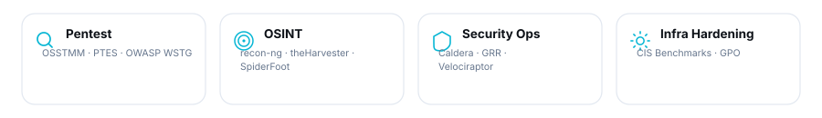
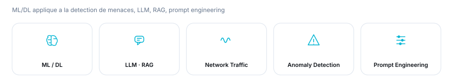
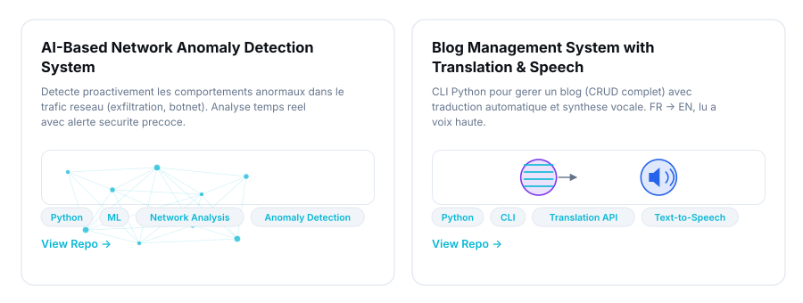
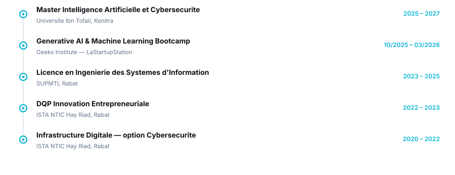
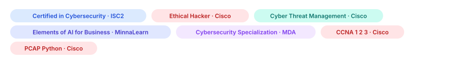
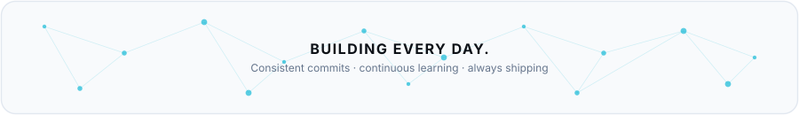
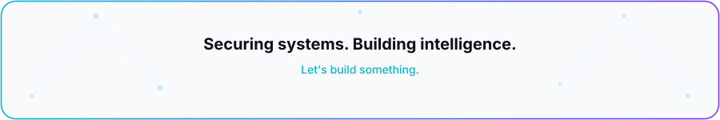

<!-- HERO -->

<picture>
  <source media="(prefers-color-scheme: dark)" srcset="assets/hero-dark.svg">
  <source media="(prefers-color-scheme: light)" srcset="assets/hero-light.svg">
  
</picture>

 

 

<!-- TERMINAL -->
## 🖥️&nbsp; SYSTEM.STATUS

<picture>
  <source media="(prefers-color-scheme: dark)" srcset="assets/terminal-dark.svg">
  <source media="(prefers-color-scheme: light)" srcset="assets/terminal-light.svg">
  
</picture>

 

<!-- SECURITY LAB -->
## 🛡️&nbsp; SECURITY LAB

<picture>
  <source media="(prefers-color-scheme: dark)" srcset="assets/securitylab-dark.svg">
  <source media="(prefers-color-scheme: light)" srcset="assets/securitylab-light.svg">
  
</picture>

 

<!-- AI × SECURITY -->
## 🤖&nbsp; AI × SECURITY

<picture>
  <source media="(prefers-color-scheme: dark)" srcset="assets/ai-security-dark.svg">
  <source media="(prefers-color-scheme: light)" srcset="assets/ai-security-light.svg">
  
</picture>

 

<!-- PROJECTS -->
## 🚀&nbsp; PROJECTS

<picture>
  <source media="(prefers-color-scheme: dark)" srcset="assets/projects-dark.svg">
  <source media="(prefers-color-scheme: light)" srcset="assets/projects-light.svg">
  
</picture>

 

<!-- EXPERIENCE -->
## 💼&nbsp; EXPERIENCE

<picture>
  <source media="(prefers-color-scheme: dark)" srcset="assets/experience-dark.svg">
  <source media="(prefers-color-scheme: light)" srcset="assets/experience-light.svg">
  
</picture>

 

<!-- FORMATION -->
## 🎓&nbsp; FORMATION

<picture>
  <source media="(prefers-color-scheme: dark)" srcset="assets/formation-dark.svg">
  <source media="(prefers-color-scheme: light)" srcset="assets/formation-light.svg">
  
</picture>

 

<!-- CERTIFICATIONS -->
## 📜&nbsp; CERTIFICATIONS

<picture>
  <source media="(prefers-color-scheme: dark)" srcset="assets/certifications-dark.svg">
  <source media="(prefers-color-scheme: light)" srcset="assets/certifications-light.svg">
  
</picture>

 

<!-- TECH STACK -->
## 🧰&nbsp; TECH STACK

**CYBERSECURITY**
 

**AI / ML**
 

**DEVELOPMENT**
 

**INFRASTRUCTURE**
 

 

<!-- GITHUB ANALYTICS -->
## 📊&nbsp; GITHUB ANALYTICS

<picture>
  <source media="(prefers-color-scheme: dark)" srcset="https://github-readme-stats.vercel.app/api?username=Zaynab693&show_icons=true&count_private=true&hide_border=false&border_color=00D9FF&bg_color=0D1117&title_color=00D9FF&icon_color=00D9FF&text_color=E2E8F0">
  <source media="(prefers-color-scheme: light)" srcset="https://github-readme-stats.vercel.app/api?username=Zaynab693&show_icons=true&count_private=true&hide_border=false&border_color=2563EB&bg_color=F8FAFC&title_color=2563EB&icon_color=2563EB&text_color=0D1117">
  
</picture>
<picture>
  <source media="(prefers-color-scheme: dark)" srcset="https://streak-stats.demolab.com/?user=Zaynab693&hide_border=false&border=00D9FF&background=0D1117&ring=00D9FF&fire=7C3AED&currStreakLabel=00D9FF&sideLabels=E2E8F0&currStreakNum=E2E8F0&sideNums=E2E8F0&dates=6E7681">
  <source media="(prefers-color-scheme: light)" srcset="https://streak-stats.demolab.com/?user=Zaynab693&hide_border=false&border=2563EB&background=F8FAFC&ring=2563EB&fire=06B6D4&currStreakLabel=2563EB&sideLabels=0D1117&currStreakNum=0D1117&sideNums=0D1117&dates=64748B">
  
</picture>

<picture>
  <source media="(prefers-color-scheme: dark)" srcset="https://github-readme-stats.vercel.app/api/top-langs/?username=Zaynab693&layout=compact&hide_border=false&border_color=00D9FF&bg_color=0D1117&title_color=00D9FF&text_color=E2E8F0&langs_count=8">
  <source media="(prefers-color-scheme: light)" srcset="https://github-readme-stats.vercel.app/api/top-langs/?username=Zaynab693&layout=compact&hide_border=false&border_color=2563EB&bg_color=F8FAFC&title_color=2563EB&text_color=0D1117&langs_count=8">
  
</picture>

<picture>
  <source media="(prefers-color-scheme: dark)" srcset="https://github-readme-activity-graph.vercel.app/graph?username=Zaynab693&bg_color=0D1117&color=E2E8F0&line=00D9FF&point=7C3AED&hide_border=true&area=true">
  <source media="(prefers-color-scheme: light)" srcset="https://github-readme-activity-graph.vercel.app/graph?username=Zaynab693&bg_color=F8FAFC&color=0D1117&line=2563EB&point=06B6D4&hide_border=true&area=true">
  
</picture>

 

<!-- CONTRIBUTION / ACTIVITY -->
## 🌐&nbsp; CONTRIBUTION ACTIVITY

<picture>
  <source media="(prefers-color-scheme: dark)" srcset="assets/network-dark.svg">
  <source media="(prefers-color-scheme: light)" srcset="assets/network-light.svg">
  
</picture>

  

<picture>
  <source media="(prefers-color-scheme: dark)" srcset="https://raw.githubusercontent.com/Zaynab693/Zaynab693/output/github-contribution-grid-snake-dark.svg">
  <source media="(prefers-color-scheme: light)" srcset="https://raw.githubusercontent.com/Zaynab693/Zaynab693/output/github-contribution-grid-snake.svg">
  
</picture>

 

<!-- FOOTER -->

<picture>
  <source media="(prefers-color-scheme: dark)" srcset="assets/footer-dark.svg">
  <source media="(prefers-color-scheme: light)" srcset="assets/footer-light.svg">
  
</picture>

